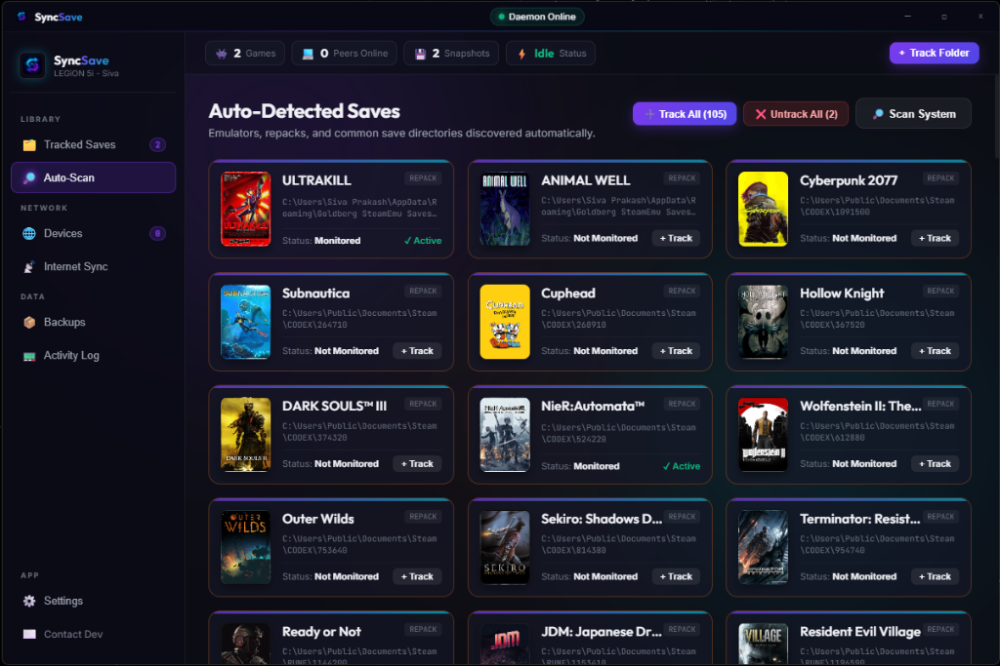
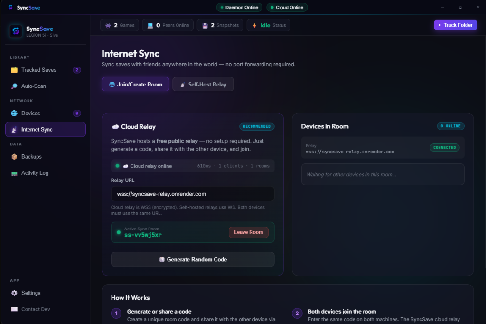

<div align="center">


# SyncSave

### Steam Cloud for every game you own.

**SyncSave** automatically syncs your game saves between devices — no Steam required, no accounts, no subscriptions. Point it at a folder, pair your devices, and your saves follow you everywhere.

[](https://github.com/sivadaboi/SyncSave/releases/latest)
[](LICENSE)
[](https://github.com/sivadaboi/SyncSave/releases/latest)
[](CONTRIBUTING.md)

[**Download for Windows**](https://github.com/sivadaboi/SyncSave/releases/download/v1.1.3/SyncSave.Setup.1.1.3.exe) · [**Download for Linux**](https://github.com/sivadaboi/SyncSave/releases/download/v1.1.3/syncsave-1.1.3.tar.gz) · [**Website**](https://sivadaboi.github.io/SyncSave)

</div>

---

> [!WARNING]
> **Important Note:** If you are experiencing any issues with syncing or cloud backups, please download and use **pre-release version 1.1.4** from the [GitHub Releases](https://github.com/sivadaboi/SyncSave/releases/tag/v1.1.4) page. This pre-release version includes critical stability patches for connection reliability, block-level sync, and cloud backup providers.

---

## The problem

Most games don't have cloud saves. Some are DRM-free. Some are emulated. Some are on a cracked copy your friend gave you ten years ago. Some just use a random folder buried deep in `AppData`.

None of them talk to each other. None of them travel between your gaming PC and your Steam Deck. None of them keep a history so you can undo a corrupted save.

**SyncSave fixes that.** It watches any folder, versions what it finds, and syncs it peer-to-peer with your other devices — over local Wi-Fi or across the internet. No cloud account. No monthly fee. No data leaves your hands.

---

## Screenshots

<div align="center">

| Auto-Scan detects your game library | Internet Sync — no port forwarding needed |
|---|---|
|  |  |

</div>

---

## Why does this exist?

| Pain point | What SyncSave does |
|---|---|
| Game has no cloud save | Watches any folder and syncs it automatically |
| Playing on Windows + Linux | Translates paths across platforms transparently |
| Steam Deck mid-playthrough | Sync over local Wi-Fi with zero configuration |
| Emulator saves scattered everywhere | Presets for RetroArch, Dolphin, PPSSPP, Ryujinx, Yuzu, PCSX2, and more |
| Corrupt save ruined your run | Snapshot history lets you roll back to any point |
| Moving to a new PC | Restore everything from a local or cloud backup |
| No internet at the venue | Works 100% offline over LAN |
| Want control over your own data | Fully self-hosted, no accounts, no telemetry |

---

## Features

### 🔍 Auto-detection
- Scans your system for games from Steam (including Goldberg, CODEX, PLAZA, Tenoke, and other Steam emulators)
- Recognizes emulator save directories: RetroArch, Dolphin, Ryujinx, Yuzu, Citra, PCSX2, RPCS3, PPSSPP, Cemu, Xenia, and more
- Instant library view with cover art fetched automatically

### 📁 Track Anything
- Track any folder — Steam saves, emulator states, GOG games, DRM-free titles, anything
- File-level change detection via SHA-256 block hashing
- Delta sync: only changed 64KB blocks are transferred, not entire files

### 🔄 Peer-to-Peer Sync
- **LAN sync**: direct connection over local network, no internet needed
- **WAN sync**: relay-based sync across the internet — no port forwarding, no static IP
- Paired device model — only your approved devices can receive your saves
- Bandwidth throttling for WAN syncs
- Automatic reconnection and retry

### 🌐 Internet Relay
- Public relay hosted at `wss://syncsave-relay.onrender.com` — free, no account required
- Self-host your own relay with a single `node src/relay-server.js` command
- One-click deploy to Render via `render.yaml` included in the repo
- Room-code based: share a code, both devices join, sync begins

### 📸 Snapshot History
- Every change triggers an automatic versioned ZIP snapshot
- Branch support — maintain separate save timelines per game
- Restore individual files from any snapshot (granular restore)
- Snapshots compressed with Brotli where supported

### ☁️ Cloud Backup
- Mirror snapshots to **Google Drive**, **Dropbox**, **OneDrive**
- Or use **WebDAV**, a **webhook**, or a **local folder**
- Cloud backup runs silently in the background on every save change
- Browse and restore from cloud directly inside the app

### 🔁 Cross-Platform Path Translation
- Windows `%APPDATA%` paths automatically translated to Linux equivalents
- Configurable custom path translation rules in Settings
- Lets Windows ↔ Linux pairs sync the same game without manual path editing

### 🛡️ Privacy-First
- No accounts, no registration, no email
- No telemetry, no crash reporting, no analytics
- All data stays on your own machines
- Relay server only brokers the WebSocket connection — it never sees your save files

### 🖥️ System Integration
- System tray icon with quick status
- Start on boot support (Windows startup registry, Linux autostart `.desktop`)
- Daemon-based architecture — the UI is optional, the sync keeps running

---

## Comparison

| Feature | SyncSave | Syncthing | LocalSend | Manual backup |
|---|:---:|:---:|:---:|:---:|
| Automatic sync on file change | ✅ | ✅ | ❌ | ❌ |
| Versioned snapshot history | ✅ | ❌ | ❌ | ❌ |
| Conflict detection & resolution | ✅ | ✅ | ❌ | ❌ |
| WAN sync (no port forwarding) | ✅ | ❌ | ❌ | ❌ |
| Emulator presets | ✅ | ❌ | ❌ | ❌ |
| Cross-platform path translation | ✅ | ❌ | ❌ | ❌ |
| Auto-detect game saves | ✅ | ❌ | ❌ | ❌ |
| Cloud backup (GDrive/Dropbox/OneDrive) | ✅ | ❌ | ❌ | ❌ |
| Granular file restore | ✅ | ❌ | ❌ | ❌ |
| Self-hosted relay | ✅ | N/A | N/A | N/A |
| No account required | ✅ | ✅ | ✅ | ✅ |
| Open source | ✅ | ✅ | ✅ | N/A |

---

## Use cases

### 🖥️ Gaming PC + Laptop
Install SyncSave on both machines, pair them over LAN or WAN. Your saves transfer automatically whenever you switch devices — no USB drives, no manual copying.

### 🪟↔️🐧 Windows ↔ Linux
Running the same game on Windows and a Linux machine? SyncSave translates save paths between operating systems so both sides stay in sync even when the folder structure differs.

### 🎮 Steam Deck
Run SyncSave on your desktop and your Deck. Sync over local Wi-Fi when you're home. Switch to WAN relay when you're on the road. The Deck's Linux paths are handled automatically.

### 🕹️ Emulator collections
RetroArch, Dolphin, PCSX2, Ryujinx — SyncSave knows where each emulator stores saves. One scan, everything tracked. Your entire emulator library backed up and in sync.

### ⏪ Backup and restore
Accidentally overwrote a 60-hour save? Snapshot history has your back. Roll back to any previous version or restore individual files from a specific point in time.

### 🏠 Self-hosted enthusiasts
Don't want to rely on the public relay? Host your own with one command. The relay is a small, stateless Node.js WebSocket server with no database and a `/health` endpoint.

---

## Quick Start

**1. Install SyncSave** on your first device (see [Installation](#installation)).

**2. Track a game.** Click **+ Track Folder**, browse to your save directory, give it a name.

**3. Pair your second device.**
   - On the same Wi-Fi? Go to **Devices** — it'll appear automatically.
   - Over the internet? Go to **Internet Sync**, generate a room code, enter it on the other device.

**4. Done.** SyncSave watches the folder and syncs whenever it changes.

---

## Installation

> [!IMPORTANT]
> **Stable Prerelease:** If you experience any syncing, peer pairing, or cloud backup issues on the release builds, please install **pre-release version 1.1.4** from [GitHub Releases](https://github.com/sivadaboi/SyncSave/releases/tag/v1.1.4).

### Windows

**Installer (recommended)**
```
https://github.com/sivadaboi/SyncSave/releases/download/v1.1.3/SyncSave.Setup.1.1.3.exe
```
Run the installer. SyncSave starts in the system tray.

**Portable ZIP**
```
https://github.com/sivadaboi/SyncSave/releases/download/v1.1.3/SyncSave-1.1.3-win.zip
```
Extract and run `SyncSave.exe`. No installation required.

---

### Linux & Steam Deck

```bash
# Download the release
wget https://github.com/sivadaboi/SyncSave/releases/download/v1.1.3/syncsave-1.1.3.tar.gz

# Extract
tar -xzf syncsave-1.1.3.tar.gz

# Run
cd syncsave-1.1.3
./syncsave
```

On Steam Deck, download and extract via the browser in Desktop Mode, then run from the file manager or terminal.

---

### Build from source

```bash
# Clone
git clone https://github.com/sivadaboi/SyncSave.git
cd SyncSave

# Install dependencies
npm install

# Run in development mode
npm run start:app

# Build distributables
npm run dist:app
```

Requires **Node.js 18+** and **npm**.

---

### Self-host the relay

```bash
# Clone the repo
git clone https://github.com/sivadaboi/SyncSave.git
cd SyncSave

# Install relay-only dependencies
cp package-relay.json package.json
npm install --omit=dev

# Start the relay
node src/relay-server.js
```

Or deploy to Render for free in two clicks — `render.yaml` is already included.

---

## FAQ

**Does this require Steam?**
No. SyncSave works with any folder on your filesystem. Steam, GOG, Epic, emulators, DRM-free — if it saves to a folder, SyncSave can track it.

**Is it cloud-based?**
No. Your saves stay on your devices. The optional relay server only brokers the WebSocket connection — it never sees your save data. Cloud backup (Google Drive, Dropbox, OneDrive) is opt-in and configured by you.

**Can I self-host everything?**
Yes. The relay is a single Node.js file with no external dependencies. You can also point cloud backup at a WebDAV server you control.

**Does it work offline?**
Yes. LAN sync works entirely offline. Snapshot history and local backups are always available without any network.

**Can I restore old saves?**
Yes. Every detected change creates a snapshot. You can browse the full history and restore any version — or restore individual files from a specific snapshot.

**Is it open source?**
Yes. MIT license. Full source on GitHub.

**Does it support emulators?**
Yes. SyncSave has built-in presets for RetroArch, Dolphin, Ryujinx, Yuzu, Citra, PCSX2, RPCS3, PPSSPP, Cemu, and Xenia. It also detects Goldberg, CODEX, PLAZA, and other Steam emulators used by repacks.

**How are conflicts handled?**
When two devices have diverged saves, SyncSave detects the conflict, takes a safety snapshot of both versions, and notifies you. You can choose which version to keep.

**How is my data protected in transit?**
LAN transfers are direct device-to-device. WAN transfers go through the relay over WSS (TLS-encrypted WebSockets). The relay never decrypts or stores your save data — it only routes packets between your paired devices.

**Does it phone home?**
Never. There is no telemetry, no analytics, no usage reporting of any kind.

---

## Architecture

SyncSave has a daemon/UI split. The daemon runs as a local HTTP server (`localhost:8383`) and handles all sync logic. The UI is an Electron shell that talks to the daemon via REST. You can run the daemon headlessly and control it via API if you want.

```
SyncSave
├── src/daemon/          # Core sync engine (Node.js)
│   ├── index.js         # Express API server
│   ├── watcher.js       # chokidar file watcher
│   ├── delta.js         # Block-level diff & patch (64KB blocks, SHA-256)
│   ├── snapshot.js      # ZIP snapshot creation & restore
│   ├── cloud.js         # Cloud backup providers
│   ├── cloud-auth.js    # OAuth flows (Google Drive, Dropbox, OneDrive)
│   ├── presets.js       # Emulator & repack save path presets
│   ├── relay-manager.js # Local relay server (self-host mode)
│   └── p2p/
│       ├── p2p.js           # Peer discovery & pairing
│       ├── sync-engine.js   # Sync state machine & conflict resolution
│       └── wan-client.js    # WebSocket relay client
├── src/frontend/        # Electron UI (HTML/CSS/JS)
├── src/relay-server.js  # Standalone relay server (deploy to Render)
└── src/main.js          # Electron entry point
```

The sync protocol is block-level: files are split into 64KB chunks, each hashed with SHA-256. Only chunks that differ are transferred, keeping bandwidth usage minimal even for large save directories.

---

## Contributing

Issues, PRs, and feature requests are all welcome.

- **Bug reports**: Open an issue with your OS, steps to reproduce, and any relevant logs from the Activity Log panel.
- **Feature requests**: Open a discussion or issue describing the use case.
- **Code contributions**: Fork, branch, and open a PR. Keep PRs focused — one feature or fix per PR.
- **New emulator presets**: Add entries to `src/daemon/presets.js` and open a PR.

There's no formal contribution guide yet. Use common sense, keep code readable, and add a test if you can.

---

## License

MIT © 2026 [Siva Prakash](https://github.com/sivadaboi)

See [LICENSE](LICENSE) for the full text.

---

<div align="center">
<sub>Built for players who believe their saves belong to them.</sub>
</div>
